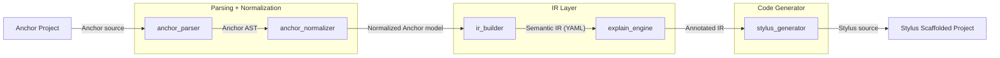

# RFC-0001: Architecture Overview

> Status: Draft  
> Date: 2025-03-25  
> Author: Scanworks Team  

---

## Summary

This RFC defines the overall architecture of `Port`, a tool that translates Rust-based smart contracts from different framework.
In the first incarnation of the tool, we focus on translating Solana Anchor smart contracts into Stylus-compatible Rust.

The system is modular, test-driven, and built around a central semantic IR (described in the next RFC document). The translation pipeline emphasizes semantic fidelity, explainability, and traceability, rather than 1:1 syntactic conversion.

Note, this document is written at the beginning of the development phase of `Port`. As such, while this gives us a principled approach, variation may and will occur as the development progresses. The reader is thus referred to the developper and user documentations. 

---

## Motivation

Central to the motivation of `Port` are the following observations:
- Solana’s Anchor framework introduces a high level of abstraction and semantic meaning, much of which should be preserved to guide the translation.
- Stylus offers powerful programmability but lacks direct support for Anchor semantics.
- Stylus similarly leverages Rust macros. However, macros in the two frameworks differ both from a syntactic and semantic perspective. 

Consequently, a modular and explainable toolchain is needed to bridge this semantic gap, enabling developers to port, inspect, and reason about their programs confidently.

---

## Goals

The architecture of `Port` aims to achieve the following goals:

- Modular pipeline. We aim for a modular pipeline, similar to the one in a compiler / transpiler, with clearly defined responsibilities per crate. Each module can be used and tested in isolation.
- Central Intermediate Representation (IR). Central to the translation is a semantic IR. Using the IR permits decoupling parsing, analysing, and generating code. The IR shall contain faithful semantic information about the program. The IR is versioned (with a version numbering in the header) and serves as a stable contract between pipeline stages.
- Integration with Rust’s best development practices, including linting, unit testing, and snapshot-based testing at every stage.
- Explainability: ability to trace output code back to original constructs.
- Identification of semantically risky or non-translatable patterns.
- Evolutive architecture. The parser and generator are swappable, allowing support for different Rust-based smart contract languages as input or output without altering the core pipeline.
- CLI-first. The tool is built as a command-line utility. However, crate boundaries are designed to permit eventual reuse through a clean API surface if needed.

---

## Non-Goals

- Source code correction or mutation.
- Support for arbitrary Rust features outside Anchor's subset.
- UI or web interface (CLI only for now) but we consider usage through an API in the future.

---

## System Overview

### Pipeline

Each stage is a distinct crate, ensuring modularization. The system currently follows a unidirectional dataflow model with traceable transformations at each step.
Each transformation stage maintains traceability metadata, enabling source-level reasoning and diagnostics across the pipeline.



Notes:
- By using a central intermediate IR and a modular architecture (with replaceable parser and code generator), we prepare the future stages of `Port` in handling different source and target Rust-based frameworks.
- Later stages of the development shall include a linter in the IR module where semantic analysis can be performed.

---

## Crates and Responsibilities

The following describes the responsibilities of each crate involved in the pipeline.

### `anchor_parser`

- Parses Anchor project source files (using `syn`).
- Resolves files and module hierarchy.
- Produces a raw Anchor AST representing the syntactic structure of the program to be translated and is suitable for downstream analysis and transformation.
- Does not perform semantic interpretation. Structure is faithful to the initial program.

### `anchor_normalizer`

- Parses the Anchor AST.
- Desugars Anchor-specific macros into structured representations.
- Classifies constructs (e.g. instructions, accounts, signers) based on Anchor semantics.
- Performs lightweight validation and emits a normalized Anchor model.
- Produces a normalized model of the program.

### `ir_builder`

- Converts the normalized Anchor model into a backend-agnostic semantic IR.
- Assigns canonical identities to program elements.
- Models Solana-specific constructs like PDAs, constraints, and discriminators.
- Captures structural patterns that may be ambiguous, risky, or non-portable.
- Captures the behavior of each instruction as a list or tree of effects where each effect captures the semantics of the instruction. Note that it is always possible to fall down to a notion of block effect as a fallback that includes the original code as a string. 

### `explain_engine`

- Associates each IR element with source-level metadata (e.g. span, file, module).
- Flags semantically risky patterns (e.g. `init_if_needed`, dynamic seeds).
- Produces human-readable descriptions for diagnostics or inline comments.

### `stylus_generator`

- Emits Stylus-compatible Rust code from the annotated IR.
- Preserves source location links via optional inline comments.
- Ensures deterministic formatting and structure for snapshot testing.

---

## Alternatives Considered

- **AST-to-code without IR**  
  Rejected due to poor explainability, testing complexity, and tight coupling of phases.

- **Correction-based linter**  
  Rejected as out of scope and to preserve semantic fidelity and avoid introducing hidden transformations.

---

## Example

This section walks through each transformation stage in the pipeline from Anchor source code to Stylus-compatible Rust. 

This section shall contain a few minimal but representative examples. 

### Hello World

We use a minimal "Hello World" program that logs a message and returns `Ok(())`.

#### Anchor source program

```rust
use anchor_lang::prelude::*;

#[program]
mod hello_world {
    use super::*;

    pub fn say_hello(ctx: Context<SayHello>) -> Result<()> {
        msg!("Hello, world!");
        Ok(())
    }
}

#[derive(Accounts)]
pub struct SayHello {}
```

#### Parsed Anchor AST

```rust
Program {
    name: "hello_world",
    functions: [
        ItemFn {
            attrs: [#[program]],
            vis: pub,
            sig: fn say_hello(ctx: Context<SayHello>) -> Result<()>,
            block: {
                msg!("Hello, world!");
                Ok(())
            }
        }
    ]
}

Structs: [
    DeriveInput {
        attrs: [#[derive(Accounts)]],
        ident: "SayHello",
        data: Struct {
            fields: [],
        }
    }
]
```

#### Normalized Anchor Model

```yaml
program: hello_world
instructions:
  - name: say_hello
    args: []
    returns: Result<()>
    body:
      - 'msg!("Hello, world!");'
      - 'Ok(())'
    accounts:
      name: SayHello
      fields: []

```

#### Intermediate Representation

Note the following artifact is a simplified version of the intermediate representation, which is described in the next RFC and will evolve during the development of `Port`.

```yaml
version: 1

program: hello_world
instructions:
  - name: say_hello
    args: []
    returns:
      type: result
      ok: unit
      err: anchor_lang::error::Error
    accounts: []
    effects:
      - kind: Log
        message: "Hello, world!"
      - kind: Return
        value:
          ok: true
```

#### Annotated Intermediate Representation

```yaml
version: 1

program: hello_world
instructions:
  - name: say_hello
    docs: >
      This instruction logs a greeting and completes successfully.
    args: []
    returns:
      type: result
      ok: unit
      err: anchor_lang::error::Error
      explanation: >
        This function returns a Result<(), Error>, following Anchor conventions.
    accounts: []
    effects:
      - kind: Log
        message: "Hello, world!"
        explanation: >
          Emits a string to the on-chain program log. This is visible to clients and block explorers.
        source:
          file: lib.rs
          span: [6, 8]

      - kind: Return
        value:
          ok: true
        explanation: >
          Returns successfully with no value. Equivalent to `Ok(())` in Rust.
        source:
          file: lib.rs
          span: [7, 8]
```

#### Stylus-Compatible Rust

```rust
#![no_std]
use stylus_sdk::prelude::*;

#[entrypoint]
fn say_hello() {
    log("Hello, world!");
}
```
